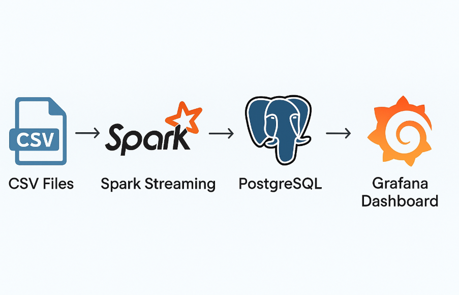
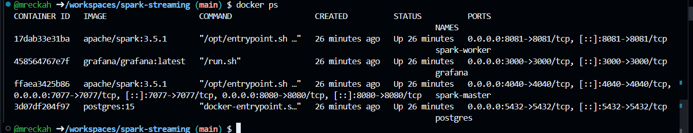
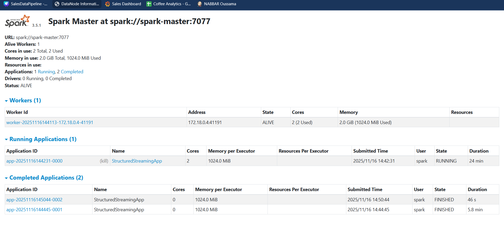
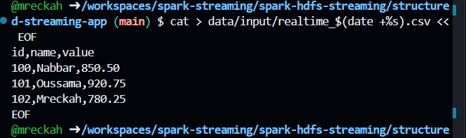
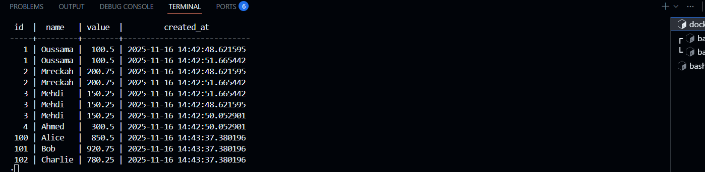
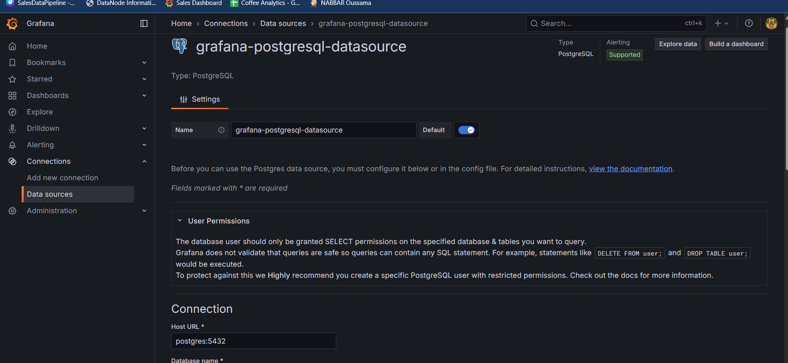
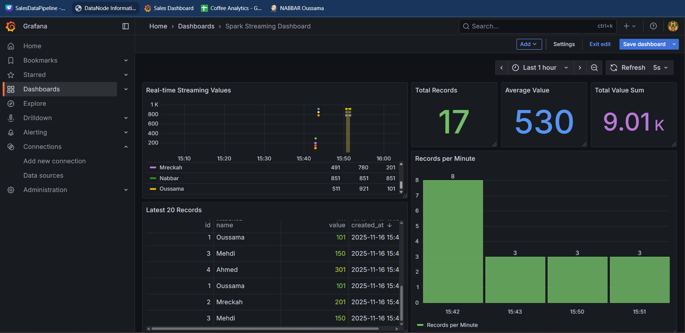

# Real-Time Streaming Pipeline
## Data-source → Spark Streaming → PostgreSQL → Grafana

Streams CSV files via Spark, stores in PostgreSQL, visualized in Grafana.

---

## Architecture


## Quick Start

### 1. Start Docker

**Screenshot: Docker containers running**


---

## Run Pipeline

### Copy JARs

```bash
docker cp target/structured-streaming-app-1.0-SNAPSHOT.jar spark-master:/tmp/app.jar
docker cp libs/postgresql-42.7.1.jar spark-master:/tmp/postgresql-42.7.1.jar
```

### Start Spark Job

**Screenshot: Spark Streaming Job Running**


---

### Add CSV Data

**Screenshot: Adding Data**


---

### Verify PostgreSQL

```bash
docker exec -it postgres psql -U postgres -d mydb -c "SELECT * FROM my_table ORDER BY id;"
```
**Screenshot: PostgreSQL Verification**

---

### Grafana Dashboard


**Screenshot: Grafana Dashboard**


---

**Made using Spark, PostgreSQL & Grafana**

